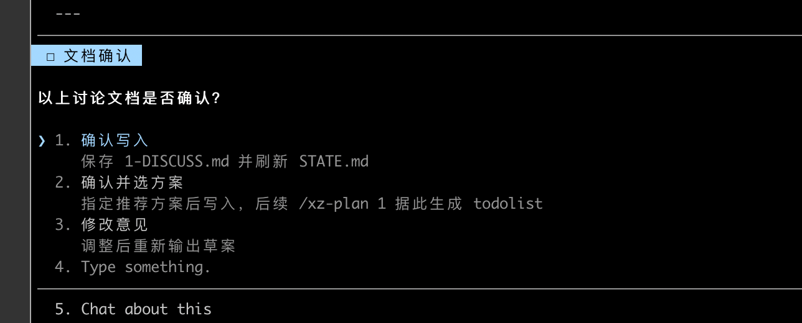
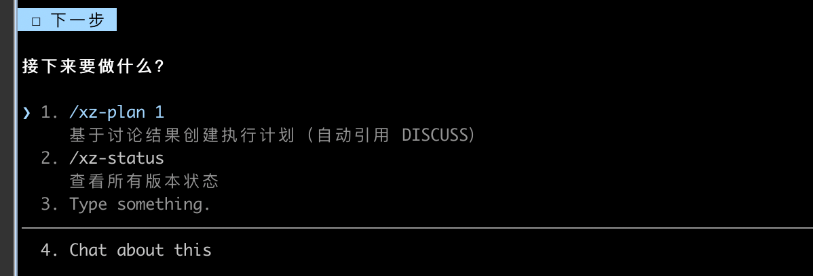
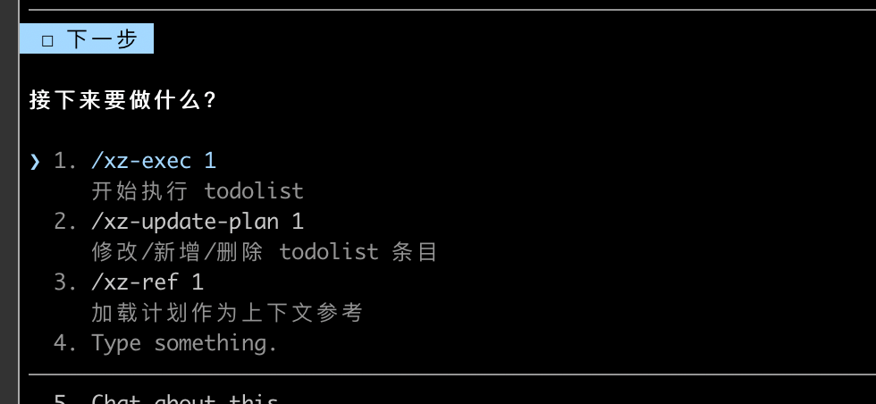
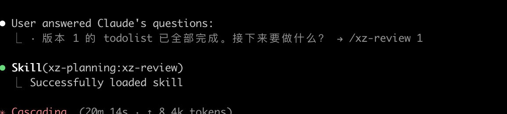
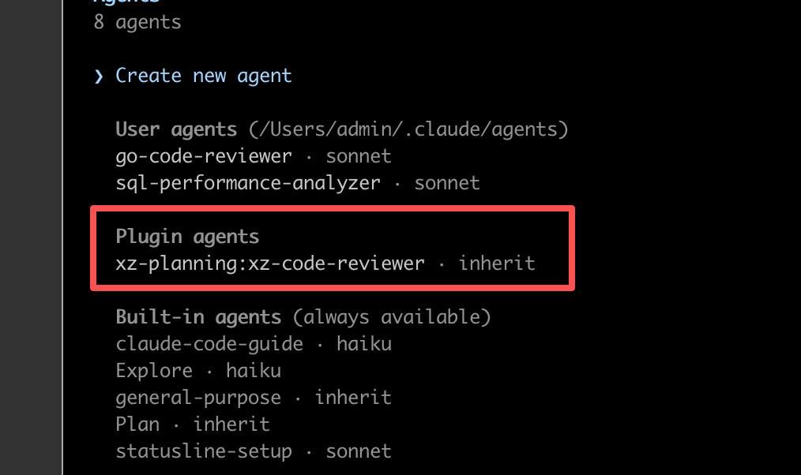
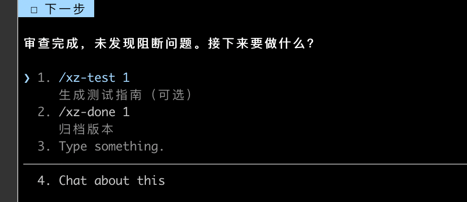
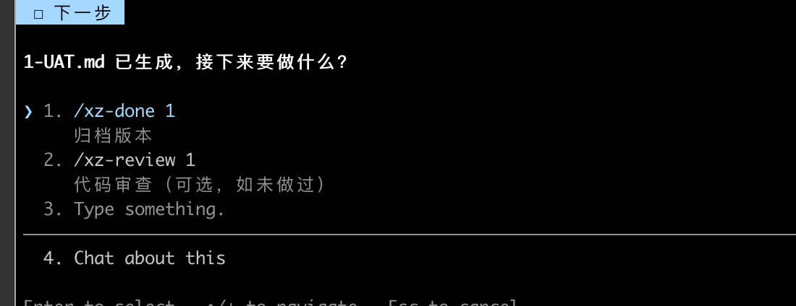

# 驱动开发流程 & Claude Code 插件


---

## 1. ai 开发目前遇到的一些问题

### 遇到问题：

### 1.AI 记不住全局, 重复对话多轮不是自己想要做的需求

普通 AI 写代码很容易只盯着眼前这几行，忘了你前面说过啥、项目整体怎么设计

### 2.ai 有时候丢需求缩水或者出现过度改动

有的时候就是做着做着跑题了，你在问的时候 ai 即兴发挥，没有一个探讨计划的过程，少了约束，或者有的东西过度改动了

### 3.需求没有一个文件记录方式

给 ai 问的问题或者需求，问完了丢失了，有的时候想参考或者继续在这个计划上改


## 2. 解决方式:


借鉴:

https://github.com/gsd-build/get-shit-done

https://github.com/obra/superpowers

https://github.com/tw93/Waza


### 2.1 项目定位

案例：自定义适合自己驱动开发插件 （XZ Planning）

XZ Planning 解决的问题：

```
Planning:
   用户: "帮我加一个用户管理功能"
   AI: (自由发挥，改了一堆文件，可能遗漏、可能过度设计)

Planning:
   用户: /xz-plan 1 用户管理功能
   AI: → 分析代码 → 提出 A/B/C 方案 → 用户选择 → 生成原子化 todolist
   用户: /xz-exec 1
   AI: → 按 todolist 逐条执行 → 每条完成后验证 → 更新进度
```

### 2.2 插件结构

```
plugin_claude/
├── .claude-plugin/
│   └── marketplace.json            ← 插件市场
└── plugins/
    └── planning/                   ← xz-planning 插件
        ├── .claude-plugin/
        │   └── plugin.json         ← 插件清单
        ├── skills/                 ← 13 个技能
        │   ├── xz-init/            ← 初始化项目
        │   ├── xz-plan/            ← 创建版本计划
        │   ├── xz-exec/            ← 执行 todolist
        │   ├── xz-discuss/         ← PM x Dev 双视角讨论
        │   ├── xz-update-plan/     ← 修改计划
        │   ├── xz-review/          ← 代码审查
        │   ├── xz-test/            ← 生成测试指南
        │   ├── xz-debug/           ← Bug 诊断（静态分析）
        │   ├── xz-debug-mode/      ← 运行时探针调试模式
        │   ├── xz-status/          ← 查看进度
        │   ├── xz-done/            ← 归档版本
        │   ├── xz-ref/             ← 加载历史版本
        │   └── xz-del/             ← 删除版本
        ├── agents/                 ← 子代理
        │   └── xz-code-reviewer.md
        ├── bin/                    ← 辅助脚本
        │   └── xz-tools.py
        └── resources/              ← 模板资源
```

### 2.3 核心工作流

XZ Planning 将开发流程标准化为 **六个阶段**：

```
  ┌─────────┐    ┌─────────┐    ┌─────────┐
  │  INIT   │───▶│ DISCUSS │───▶│  PLAN   │
  │ 初始化   │    │ 需求讨论? │    │ 制定计划  │
  └─────────┘    └─────────┘    └─────────┘
                                     │
  ┌─────────┐    ┌─────────┐         ▼
  │  DONE   │◀───│ REVIEW  │◀───┌─────────┐
  │  归档    │    │ test  ? │    │  EXEC   │
  └─────────┘    └─────────┘    │ 执行计划  │
                                └─────────┘
```

每个阶段对应一个或多个 Skill 命令：

| 阶段 | 命令 | 核心行为 |  |
|:-----|:-----|:---------|------|
| 初始化 | `/xz-planning:xz-init` | 扫描项目结构，生成 PROJECT.md 快照 | /xz-init |
| 需求讨论 | `/xz-planning:xz-discuss 1 需求` | 启动 PM 和 Dev 双代理并行分析，输出 A/B/C 方案<br />/xz-discuss 1 帮我用 Python 写一个命令行 Todo List，支持新增任务、查看任务、标记完成、删除任务，数据保存到本地 JSON 文件 |  |
| 制定计划 | `/xz-planning:xz-plan 1 需求` | 分析代码 → 提出方案 → 用户确认 → 生成原子化 todolist |  |
| 执行计划 | `/xz-planning:xz-exec 1` | 逐条执行 todo，每条完成后语法检查并更新状态 |  |
| 代码审查 | `/xz-planning:xz-review 1` | 调用 xz-code-reviewer 代理审查变更 |  |
| 生成手动测试 | `/xz-planning:xz-test 1` | 生成手动测试文档 UAT.md |  |
| 归档 | `/xz-planning:xz-done 1` | 检查完成度，归档到 archive/ 目录 |  |


```
                          ┌─────────────────────────────────┐
                          │  /xz-planning:xz-init            │  必须，首次使用前执行
                          └──────────────┬──────────────────┘
                                         ↓
                     ┌───────────────────────────────────────────┐
                     │  /xz-planning:xz-discuss N 讨论内容        │  可选，头脑风暴
                     └───────────────────┬──────────────────────┘
                                         ↓
                          ┌─────────────────────────────────┐
                          │  /xz-planning:xz-plan N 需求描述  │  必须，生成 todolist
                          └──────────────┬──────────────────┘
                                         ↓
                          ┌─────────────────────────────────┐
                     ┌──→ │  /xz-planning:xz-exec N          │  必须，逐条执行
                     │    └──────────────┬──────────────────┘
                     │                   ↓
                     │    ┌─────────────────────────────────┐
                     └────│  /xz-planning:xz-update-plan N   │  可选，中途增删改条目
                          └──────────────┬──────────────────┘
                                         ↓
                     ┌───────────────────────────────────────────┐
                     │  /xz-planning:xz-review N                  │  可选，代码审查
                     └───────────────────┬──────────────────────┘
                                         ↓
                     ┌───────────────────────────────────────────┐
                     │  /xz-planning:xz-test N                    │  可选，生成测试指南
                     └───────────────────┬──────────────────────┘
                                         ↓
                          ┌─────────────────────────────────┐
                          │  /xz-planning:xz-done N          │  必须，归档
                          └─────────────────────────────────┘
```

**辅助技能**（按需手动调用，不在主线流程中）：

| 命令 | 用途 |
|:-----|:-----|
| `/xz-planning:xz-update-plan N 操作` | 中途增删改 todolist 条目 |
| `/xz-planning:xz-status` | 查看所有版本进度总览 |
| `/xz-planning:xz-ref N` 或 `N1,N2,N3` | 加载历史版本作为上下文 |
| `/xz-planning:xz-del N` | 删除单个版本目录 |
| `/xz-planning:xz-debug 问题描述` | 静态分析：根据现象查 bug 给修复建议 |
| `/xz-planning:xz-debug-mode 问题描述` | 运行时探针：插日志、收集证据、定位偶发/竞态 bug |

**xz-debug vs xz-debug-mode 怎么选？**

- **xz-debug**：静态分析，读代码 + 经验推断。适合堆栈清晰、错误信息明确、能直接定位的 bug
- **xz-debug-mode**：运行时探针，插入日志 → 复现 → 收日志 → 基于证据定位。适合静态看不出原因的偶发问题，比如竞态、时序、性能、内存泄漏、回归。日志写入项目根的 `.debug_log/`，并自动加入 `.gitignore`


### 2.3 设计点

**1. 证据驱动的方案设计**

```markdown
<!-- xz-plan SKILL.md 中的关键约束 -->
- 只提出从代码分析中得出的方案，不做主观推测
- 必须提供 A/B/C 三个方案供用户选择
- 绝不自动选择方案
```

**2. 原子化 Todolist**

每个 todo 不超过 2-5 分钟的工作量，并包含精确的变更规格：

```markdown
- [ ] 1. 创建用户模型
  - 变更: 新建 `models/user.go`
  - 函数: `type User struct`, `func NewUser()`
  - 说明: 定义用户实体和构造函数
```

**3. 双代理协作 (xz-discuss)**

同时启动两个子代理，模拟产品经理和开发者的视角碰撞：

```
        ┌────────────────┐
        │   用户需求输入   │
        └───────┬────────┘
                │
        ┌───────┴───────┐
        ▼               ▼
  ┌──────────┐   ┌──────────┐
  │ PM Agent │   │Dev Agent │
  │ 产品视角   │   │ 技术视角  │
  └─────┬────┘   └────┬─────┘
        │              │
        └──────┬───────┘
               ▼
        ┌────────────┐
        │ 综合 A/B/C  │
        │   方案输出   │
        └────────────┘
```

**4. 状态全程可追踪**

```
STATE.md — 全局状态表
├── phases/1/  → 版本 1（进行中）
│   ├── 1-DISCUSS.md
│   ├── 1-PLAN.md
│   └── 1-UAT.md
└── archive/0/ → 版本 0（已归档）
```

---

## 3. Claude Code 插件

> 参考文档：
> https://code.claude.com/docs/en/plugins

> https://code.claude.com/docs/en/plugin-marketplaces

### 3.1 插件的组成元素

一个完整的 Claude Code 插件可以包含以下组件：

```
my-plugin/
├── .claude-plugin/
│   └── plugin.json          # 插件清单
├── skills/                  # 技能定义
│   └── my-skill/
│       └── SKILL.md
├── agents/                  # 子代理定义
│   └── reviewer.md
├── hooks/                   # 钩子
│   └── hooks.json
├── bin/                     # 可执行脚本（工具箱）
├── .mcp.json                # MCP 服务器配置（外部工具集成）
├── .lsp.json                # LSP 服务器配置（代码智能）
├── settings.json            # 默认设置
└── resources/               # 静态资源
```

> **注意：** `skills/`、`agents/`、`hooks/` 等目录放在插件根目录下，**不要**放进 `.claude-plugin/` 内部。`.claude-plugin/` 里只有 `plugin.json`。

---

### 3.2 从零构建一个插件

### Step 1: 创建插件目录与清单

每个插件的起点是一个 `plugin.json` — 它就像插件的"身份证"：

```bash
mkdir -p my-plugin/.claude-plugin
```

```json
// my-plugin/.claude-plugin/plugin.json
{
  "name": "my-plugin",
  "description": "插件的一句话描述",
  "version": "1.0.0",
  "author": {
    "name": "Your Name"
  }
}
```

**字段说明：**

| 字段 | 作用 |
|:-----|:-----|
| `name` | 唯一标识符，同时作为技能的命名空间前缀（如 `/my-plugin:hello`） |
| `description` | 在插件管理器中展示的描述 |
| `version` | 语义化版本号，用于追踪发布 |
| `author` | 可选，用于归属标识 |

---

### Step 2: 定义 Skill（技能）

Skill 是插件的核心 — 它定义了 AI 在收到指令后**具体怎么做事**。

每个 Skill 是一个文件夹，包含一个 `SKILL.md` 文件：

```bash
mkdir -p my-plugin/skills/hello
```

```markdown
<!-- my-plugin/skills/hello/SKILL.md -->
---
name: hello
description: 以友好的方式问候用户
disable-model-invocation: true
argument-hint: "[用户名]"
---

# Hello Skill

热情地问候名为 "$ARGUMENTS" 的用户，并询问今天有什么可以帮助的。
```

**SKILL.md 的 frontmatter 字段：**

| 字段 | 说明 |
|:-----|:-----|
| `name` | 技能名称 |
| `description` | 技能描述，Claude 根据此描述判断何时自动调用 |
| `disable-model-invocation` | 设为 `true` 则不触发模型调用，仅输出模板文本 |
| `argument-hint` | 参数提示，帮助用户了解需要传入什么 |
| `$ARGUMENTS` | 占位符，捕获用户在技能名之后输入的所有文本 |


---

## 4. 插件的分发与协作

### 4.1 Marketplace（市场）机制

Claude Code 使用 **marketplace** 来组织和分发插件。一个 marketplace 可以包含多个插件：

```json
// .claude-plugin/marketplace.json
{
  "name": "xz-tools",
  "owner": { "name": "admin" },
  "metadata": {
    "description": "XZ 系列 Claude Code 插件市场",
    "version": "1.0.0"
  },
  "plugins": [
    {
      "name": "xz-planning",
      "source": "./plugins/planning",
      "description": "轻量级版本计划驱动开发",
      "version": "1.0.0"
    }
  ]
}
```

### 4.2 安装方式

**方式一：通过市场安装（推荐）**

```bash
# 1. 添加市场（本地路径或 GitHub）
/plugin marketplace add /Users/admin/go/src/myai/plugin_claude
/plugin marketplace add Xuzan9396/plugin_claude
/plugin marketplace add xuzan01111/plugin_claude

# 2. 安装插件
/plugin install xz-planning@xz-tools

# 3. 重载
/reload-plugins
```

**方式二：开发调试模式**

```bash
# 直接加载插件目录
claude --dangerously-skip-permissions  --plugin-dir /Users/admin/go/src/myai/plugin_claude/plugins/planning

# 支持同时加载多个插件
claude --plugin-dir ./plugin-one --plugin-dir ./plugin-two
```

### 4.3 管理命令

```bash
/plugin marketplace list           # 查看已安装的市场和插件
/plugin marketplace update xz-tools # 更新市场内容
/plugin uninstall xz-planning@xz-tools  # 卸载插件
/plugin marketplace remove xz-tools     # 删除市场
```

### 4.4 本地改动后如何让插件生效

本地源改动（SKILL.md / agents / bin 脚本）不会自动同步到 `~/.claude/plugins/cache/` 下的安装副本。改完源码需要重装：

```bash
/plugin uninstall xz-planning@xz-tools
/plugin install xz-planning@xz-tools
/reload-plugins
```

说明：
- `uninstall` 清掉旧缓存；`install` 从市场（本地路径或 GitHub）重新拉取当前源；`reload-plugins` 应用变更
- 若只改了 `plugin.json` 的 `version` 并推到远程市场，也可以用 `/plugin marketplace update xz-tools` + `/reload-plugins` 触发更新
- 改完没生效前先怀疑是不是缓存还是旧版 —— `ls ~/.claude/plugins/cache/xz-tools/xz-planning/` 看版本号是否对得上

---

## 6. 总结

#####  驱动开发的整个流程都是大致差不多的，某些细节可能需要自己微调，更适应自己的项目


```
┌────────────────────────────────────────────────┐
│           框架驱动开发 = 可控 + 可复用 + 可协作      │
├────────────────────────────────────────────────┤
│                                                │
│  可控     用 Skill 约束 AI 行为              │
│                                                │
│  可复用   一次编写，到处使用                        │
│           团队共享同一套最佳实践                     │
│                                                │
│  可协作   通过 Marketplace 分发                   │
│           版本管理，持续迭代                    │
│                                                │
└────────────────────────────────────────────────┘
```


`建议`

#####  1. Ai 驱动开发，很多细节还需要被探索，更好的协助自己完成更精准的任务， 尽量做到短小而精悍，减少大量消耗token

##### 2.根据好开源的最佳实践，实现一个适合公司项目或者个人

#####  3.开源的提示词工程也不是适合每个人项目，最重要能项目能快速又同时安全落地这个才是核心所在
